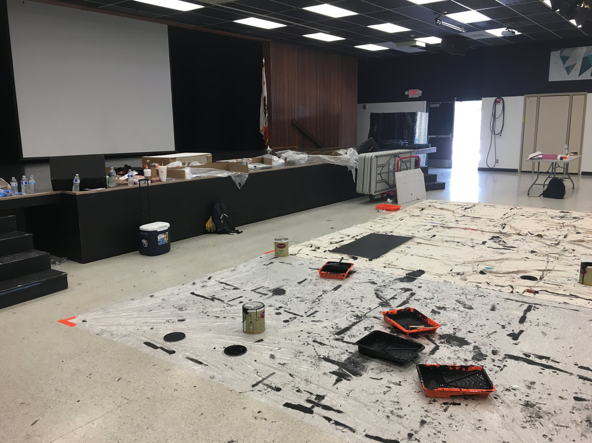
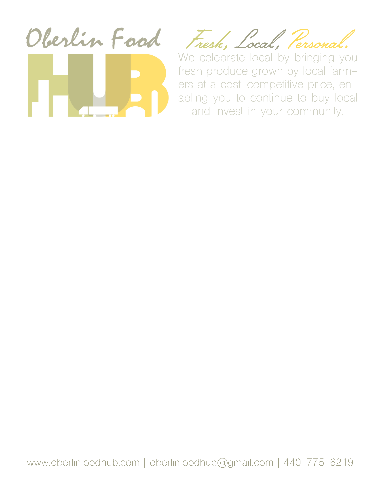

# Co-Curriculars

## Connector Assistant
_Division of Data Sciences, UC Berkeley_

I started at DDS in January 2019 as a connector assistant for L&S 88: Reproducibility & Open Science. This class teaches data science students about the culture in data science and the importance of reproducibility in results. The class covers technical topics ranging from Jupyter Notebooks to Markdown & LaTeX to Git. As connector assistant, my role was twofold: I attended class and acted as a lab assistant during the lab portion of the class, and I worked with the course instructors (Eric Van Dusen & Joshua Quan) to develop assignments that fit with the narrative they had for the course. [One of the labs that I facilitated](https://github.com/chrispyles/uc-berkeley/tree/master/ls88-sp19/lab01) was on the importance of code annotation, and the goal was that students would learn about why it is important to include the reasoning behind and comments in code so that others can reproduce your work using different technologies.

## Eagle Scout
As of October 19, 2016, I am an Eagle Scout. The highest award in the Boy Scouts of America, I worked my way up through seven ranks and twenty-something merit badges before completing an Eagle Scout Service Project in order to obtain this honor. The Eagle Project involved designing, funding, and completing a project to benefit a local nonprofit; my project involved repainting ceiling tiles in my high school’s MPR. You can see my project notebook (from proposal to conclusion) [here](assets/eagle_project_wb.pdf).

## Foresight Prep @ Oberlin: Future of Communications
I attended a seminar in July 2017 on communications at Oberlin College. This seminar was such and interesting experience for me: it was a chance for me to break out of my STEM-oriented coursework and to look into fields with more of a liberal arts focus. While I did decide on pursuing an Applied Maths degree, attending Foresight Prep opened my eyes to lots of different ways of communicating and gave me innumerable skills that I am confident will be a great aid in my professional life after university. Most of the class was focused on college prep and presentation skills, the latter of which I know will come into play. The final project that we completed as a part of the seminar was to develop, in groups of 3, a communications plan for a local nonprofit; my group’s nonprofit was the Oberlin Food Hub. You can see some of the work that I did below, and look at the website mockup we made at [comsfoodhub.weebly.com](https://comsfoodhub.weebly.com).

This is one of the materials that I made for the Oberlin Food Hub as a part of the project. It is a template for a flier that they can use, created using Adobe InDesign in conjunction with Photoshop.

