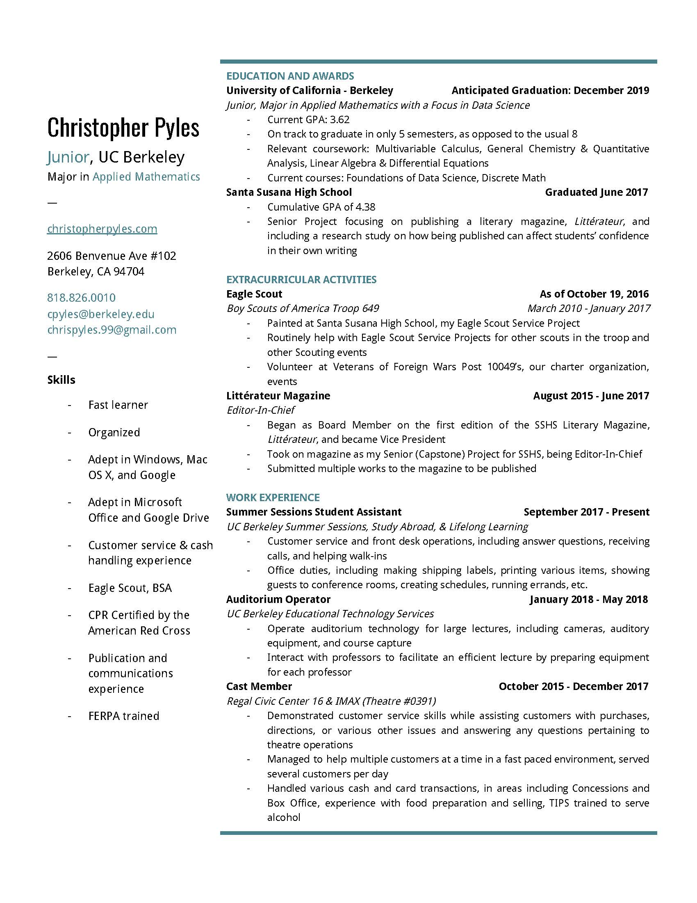
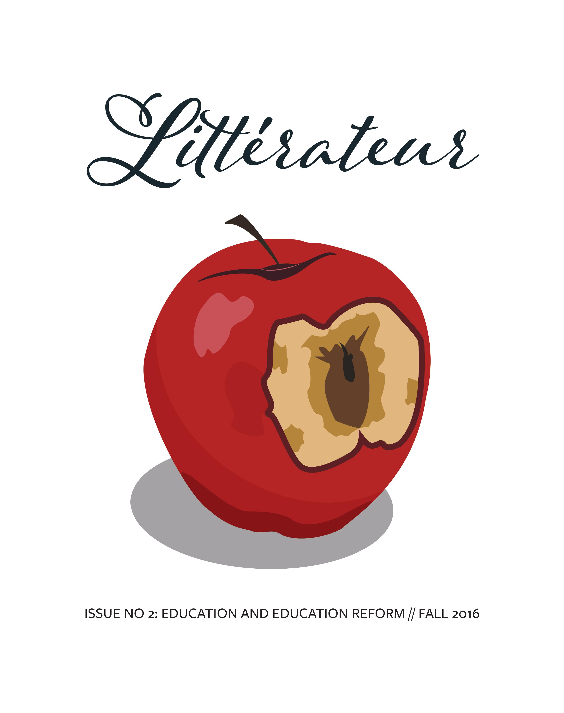

## Chris Pyles: Portfolio

### About Me
I am currently in my second year at UC Berkeley, and I am intending to major in Applied Mathematics with a focus in Data Science. I want to go into something finance- or data-related, but I've always enjoyed maths and I want to do something where I get to work with that on a daily basis. Because of my dedication to my high school coursework, I will likely graduate in only 5 semester, ending with a BA in December 2019. After this point, I'm unsure of where I would like to go. One part of me would love to have the chance to continue school in the form of graduate coursework, but another wants to go straight into a career with my newfound knowledge of data science and financial systems.




## Education

### University of California, Berkeley

I am currently attending UC Berkeley to earn my BA in Applied Maths, with an anticipated graduation of December 2019 and a cumulative GPA of 3.62. While studying, I am trying to also take classes that are relevant to my interest in financial systems and the economy, while also working on-campus and being active in extra-curriculars.

| Freshman | Sophomore | Junior |
| --- | --- | --- |
| *Fall 2018*: Multivariable Calculus, General Chemistry & Quantitative Analysis | *Fall 2019*: Structure and Interpretation of Computer Programs (CS 61A), Linear Algebra, Intro to Analysis, Contemporary Theories of Political Economy |  |
| *Spring 2018*: Linear Algebra & Differential Equations |  |  |
| *Summer 2018*: Foundations of Data Science (Data 8), Discrete Math |  |  |

#### Work Samples
In the course of my work while taking Introduction to Culture and Natural Resource Management with Dr. Kurt Spreyer, I participated in Dr. Spreyer's research involving the development of the East Bay shoreline. As a part of this project, I used UC Berkeley's `datascience` module of Python to do various analyses of the demographic changes of the East Bay. My work is published on the site we created, which can be found [here](https://sites.google.com/berkeley.edu/espm50-spreyer/demography).

In my own free time, I used what I learned between sitting in on Data 8 lectures during my work at ETS and some studying I did for CS 61A to write a python function that takes in a table with a filled in sudoku puzzle and determines whether or not the puzzle is solved correctly. Here is the program:

```
from datascience import *
import numpy as np
np.set_printoptions(threshold=np.inf)

def check_sudoku(sudoku_table):
    ''' Takes a 9x9 table (not including column title row) of sudoku 
    solutions and determines whether or not they meet the rules of sudoku'''
    collection_array = make_array()
    for i in np.arange(1, 10, 1):
        for j in np.arange(9):
            num_occurances = np.count_nonzero(sudoku_table.column(j) == i)
            if num_occurances == 1:
                collection_array = np.append(collection_array, 1)
            else:
                print("Sorry, but your answers don't work.")
                print(collection_array)
                return len(collection_array)
    for i in np.arange(1, 10, 1):
        for j in np.arange(9):
            num_occurances = np.count_nonzero(sudoku_table.row(j) == i)
            if num_occurances == 1:
                collection_array = np.append(collection_array, 1)
            else:
                print("Sorry, but your answers don't work.")
                print(collection_array)
                return len(collection_array)
    if np.sum(collection_array) == 162:
        print('Congratulations! Your sudoku answers check out!')
        return collection_array
    else:
        print("Sorry, but your answers don't work.")
        return collection_array
```

The first few lines of code import the UC Berkeley `datascience` module and the module NumPy to work with arrays. The function prints a line that tells you whether or not your table is a solution, but it also returns the array `collection_array`, which I used while writing the program in order to determine where the faults lay in the iterations (the `for` loops).

### Santa Susana High School

I graduated from SSHS in June 2017 with a cumulative GPA of 4.38. While at SSHS, I mainly focused on my interest in the hard sciences, like chemistry, and a fondness for anatomy that fostered from growing up with a mother who was a nurse. In the 12th grade, I took an Anatomy & Physiology course wherein our final project was to write a dissection manual for the dissection of a rabbit's respiratory system; you can view the finished product [here](https://docs.google.com/file/d/0B7kiIqQskeaWZkluR2xhTTBqX28/preview). 



I also completed a a Senior Project (what we termed out capstone projects), which involved publishing an issue of our literary magazine, [*Littérateur*](https://docs.google.com/file/d/0B7kiIqQskeaWdXU4RUg3bDhXSDQ/preview). The issue for which I was Editor-In-Chief focused on the US education system and its benefits and pitfalls. The publishing of this magazine I consider to be one of my greatest achievements, among such others as attaining the rank of Eagle Scout. 


## Experience

##### Student Assistant
*UC Berkeley Summer Sessions, Study Abroad, and Lifelong Learning, September 2017 - Present*
As a student assistant, customer service skills are at the crux of my responsibilities. I interact with all of the students who need assistant from the Student Services team, and so I need to effectively work with others, and be able to help alleviate the concerns of others, give information regarding different aspects of summer courses, and perform basic office tasks. I also have a few different projects; one of my most recent was developing the training for other student assistants, which can be found here.

##### Auditorium Operator
*UC Berkeley Educational Technology Services, January 2018 - May 2018*
As an auditorium operator, I operated the camera, audio, and other technical equipment in order to facilitate the effect running of a large (700+ person) lecture. I also interact with the professors of the courses in order to understand what they need for the lecture, and to deliver information about the auditorium if it is needed. This is another position in which customer service skills are essential, since most of my interactions with the professors occur when there are technical difficulties. It was in this capacity that I sat in on the Data 8 lectures in Spring 2018 and discovered my interest in the field, which sparked the desire to change my Applied Maths focus to the subject. It is also how I learned the `datascience` module before taking Data 8.

##### Cast Member
*Regal Civic Center 16 & IMAX, October 2015 - December 2017*
As a cast member at Regal, I developed most of my customer service skills by interacting with many guests (the average attendance on the weekends was 3,500 guests per day). I assisted guests with purchases, directions, and other issues; in fact, I dealt with many power outage issues, including handling guest service (refunds, swaps, etc.) and bringing projection back online after a blackout. During my time at Regal, I took on many responsibilities outside the scope of my job description, routinely handling projects that I volunteered for in order to learn ore about operations; I even learned how to operate projection, normally a function of management!
